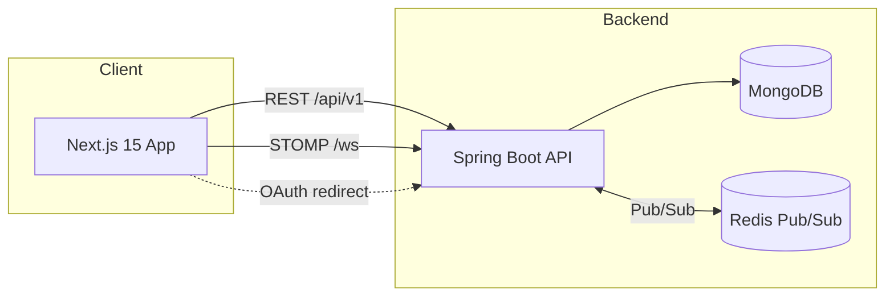

# ChatMee


## Project Name and Description
ChatMee is a full-stack, OAuth2-secured chat platform that combines a Spring Boot backend with a modern Next.js frontend. It delivers real-time messaging, typing indicators, and presence tracking over STOMP/WebSocket channels while persisting room metadata and message history in MongoDB.

## Technology Stack
| Layer | Technologies |
| --- | --- |
| Backend | Java 17, Spring Boot 3.5.5, Spring Data MongoDB, Spring Security + OAuth2 (Google/GitHub), Spring WebSocket/STOMP, Redis Pub/Sub, Actuator, Lombok |
| Frontend | Next.js 15.5.2 (App Router), React 19, TypeScript 5, Tailwind CSS 4 + shadcn/ui, Zustand, Axios, react-hot-toast, react-resizable-panels, Fuse.js, @stomp/stompjs + SockJS |
| Tooling & Ops | Maven Wrapper, Docker (multi-stage backend image), Vercel rewrites, Render-hosted backend, GitHub Actions placeholders |

## Project Architecture
The repository is a monorepo with two deployable services:
- The **Next.js client** proxies API, OAuth, and WebSocket traffic through rewrites (see `frontend/next.config.ts` and `frontend/vercel.json`).
- The **Spring Boot API** exposes REST endpoints under `/api/v1/**` and brokers STOMP traffic at `/ws`. It stores long-lived data in MongoDB and publishes transient presence events through Redis (`RedisConfig`).



*Key backend packages:* `config/` (CORS, security, WebSocket), `controller/` (Auth, ChatRoom, Message, Presence, Typing), `service/` (business logic, Redis publishers/subscribers), `model/` (MongoDB documents), `dto/` and `repository/`.

## Getting Started
### Prerequisites
- Java 17+ and Maven 3.9 (or use `backend/mvnw`)
- Node.js 20+ with npm (or pnpm/bun)
- MongoDB instance (local or Atlas) and Redis (local or Upstash)
- OAuth2 credentials for Google (GitHub optional)

### Backend (Spring Boot)
```bash
cd backend
cp src/main/resources/application-dev.properties.example .env # (create your secrets file)
# Required environment variables
setx MONGO_URI_DEV "mongodb://localhost:27017/chatmee"
setx GOOGLE_CLIENT_ID "<client-id>"
setx GOOGLE_CLIENT_SECRET "<client-secret>"
setx GITHUB_CLIENT_ID "<optional>"
setx GITHUB_CLIENT_SECRET "<optional>"
setx REDIS_URL "redis://localhost:6379"
./mvnw spring-boot:run
```
Useful properties live in `application-dev.properties` and `application-prod.properties`:
- `app.client.url` to point at the running frontend (`http://localhost:3000` by default)
- OAuth redirect URIs (match Google/GitHub console settings)
- `spring.data.mongodb.uri` and `spring.data.redis.*`

To build a production jar or docker image:
```bash
./mvnw clean package -DskipTests
cd backend
docker build -t chatmee-api:latest .
```

### Frontend (Next.js)
```bash
cd frontend
cp .env.example .env.local  # create if it does not exist
npm install
# Minimal env values
echo "NEXT_PUBLIC_WS_URL=http://localhost:8080/ws" >> .env.local
echo "NEXT_PUBLIC_API_URL=http://localhost:8080" >> .env.local
npm run dev
```
`next.config.ts` rewrites `/api`, `/oauth2`, `/login`, `/logout`, and `/ws` to the backend while developing; `vercel.json` performs the same rewrites in production.

## Project Structure
```
.
├── backend/
│   ├── Dockerfile
│   ├── pom.xml
│   └── src/main/java/com/lnt/chatmee/
│       ├── config/        # Security, WebSocket, Redis, OAuth2 handlers
│       ├── controller/    # AuthApi, ChatRoom, Message, Presence, Typing endpoints
│       ├── dto/           # ApiResponse, room/message payloads
│       ├── model/         # MongoDB documents for users, rooms, messages
│       ├── repository/    # Spring Data repositories
│       └── service/       # ChatRoomService, MessageService, RedisPresencePublisher
├── frontend/
│   ├── app/               # App Router layouts (dashboard, login, profile)
│   ├── components/        # chat UI, room management, shared UI primitives
│   ├── hooks/             # useWebSocket, useRoomMessages, responsive helpers
│   ├── lib/               # API clients, Zustand stores, type definitions
│   └── public/
└── WARP.md                # Additional architecture & workflow notes
```

## Key Features
- **OAuth2 authentication** with Google (and optional GitHub) handled by `SecurityConfig` and `CustomOAuth2UserService`.
- **Real-time messaging** via STOMP over SockJS; `WebSocketConfig` and `useWebSocket` manage bidirectional connections, retries, and subscriptions per room.
- **Presence + typing indicators** backed by Redis pub/sub (`RedisPresencePublisher`, `RedisPresenseSubcriber`) and rendered through Zustand stores.
- **Flexible chat rooms** supporting public, private, and direct messages with per-room settings (`ChatRoom.RoomSettings`).
- **Optimistic UI updates & caching** through `useRoomMessages`, session caches, and `messageReducer` to keep local state responsive.
- **Fuzzy room discovery** using Fuse.js filters inside `chatRoomsStore` and responsive dashboards built with `react-resizable-panels`.
- **Production-friendly delivery** with Dockerized backend, Vercel rewrites, and default Render deployment (`chatmee-wxvk.onrender.com`).

## Development Workflow
- **Local dev**: run backend (`./mvnw spring-boot:run`) and frontend (`npm run dev`) concurrently; WebSocket + REST traffic is proxied automatically through Next rewrites.
- **Branching**: adopt feature branches off `main` (e.g., `feature/presence-batching`), then open PRs for review—GitHub Actions workflows (`.github/workflows`) are placeholders ready for CI scripts.
- **Environments**: Use `dev` profile locally; Docker image defaults to `prod` profile and exposes port `10000`.
- **Monitoring & Ops**: Actuator endpoints (`/actuator/env`, `/actuator/health`) are exposed for health checks, and the Dockerfile defines an HTTP health probe.

## Coding Standards
- **Backend**
  - Follow the layered package layout shown above; keep controllers thin and prefer service-level business logic.
  - Use `ApiResponse<T>` DTOs for consistent responses and Lombok builders for immutability.
  - Configure new WebSocket topics via `WebSocketConfig` and guard REST endpoints with `SecurityConfig` policies.
- **Frontend**
  - Use functional React components with hooks; keep global UI state inside Zustand stores under `frontend/lib/stores`.
  - Reuse primitives from `components/ui` (shadcn/ui) and adhere to Tailwind utility conventions defined in `globals.css` and `tailwind.config.ts`.
  - Centralize HTTP calls in `lib/api/*`, always returning typed `ApiResponse` objects.

## Testing
- **Backend**: Run `./mvnw test` for Spring Boot context tests (see `backend/src/test/java`). Expand on the existing config/controller test skeletons when adding new endpoints.
- **Frontend**: `npm run lint` exercises the ESLint config. Add React Testing Library or Playwright specs alongside components/pages as the UI grows (no automated tests are committed yet).
- **Integration**: Smoke-test OAuth + WebSocket flows by logging in and opening multiple browser sessions; presence and typing updates depend on Redis connectivity.

## Contributing
1. Fork and clone the repository, then create a feature branch (`git checkout -b feature/<short-description>`).
2. Keep backend and frontend changes in separate commits when possible; run `./mvnw test` and `npm run lint` before pushing.
3. Follow the coding standards above (layered Spring packages, typed API responses, Zustand-based state) and mirror existing patterns such as optimistic message handling.
4. Open a pull request to `main` with a summary of backend APIs, UI changes, and any new environment variables. Include screenshots or cURL examples for chat features when relevant.

## License
This project is licensed under the MIT License - see the [LICENSE](LICENSE) file for details.
